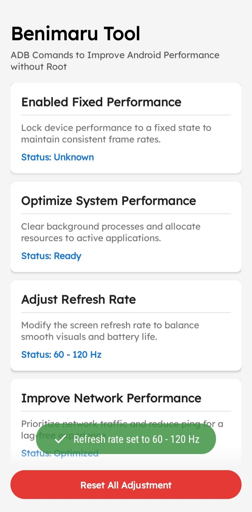
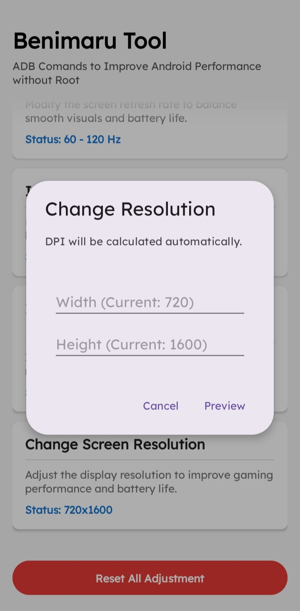
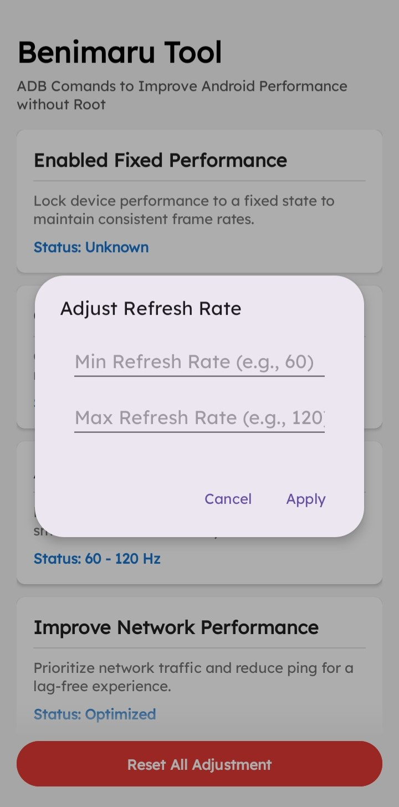

# Benimaru Tool ⚡

Benimaru Tool is a powerful, rootless Android utility application designed to enhance device performance, reduce touch latency, and customize display settings. By utilizing the [Shizuku](https://shizuku.rikka.app/) API, this app executes advanced ADB shell commands directly from your device—no PC or root access required after the initial setup.

## ✨ Features

*   🚀 **Fixed Performance Mode**: Locks device performance to a fixed state to maintain consistent frame rates during heavy workloads or gaming.
*   🧹 **System Optimization**: Clears background processes and reallocates resources to your active applications.
*   📶 **Network Tweaks**: Prioritizes network traffic and reduces ping for a lag-free mobile data experience.
*   ⚡ **Touch Latency Reduction**: Increases touch sampling rate and reduces long-press timeouts for faster, more precise screen interactions.
*   🔄 **Custom Refresh Rate**: Force specific Minimum and Maximum screen refresh rates (e.g., lock to 120Hz).
*   📱 **Safe Resolution Changer**: Adjust your display resolution to improve gaming performance or battery life. Includes an **automatic DPI calculator** and a **6-second safe-revert countdown** to prevent permanent black screens.
*   🎯 **FPS Crosshair Overlay**: Enable a persistent, center-screen red crosshair to improve accuracy in FPS games.
*   🎮 **Quick Game Launcher**: Automatically detects installed games on your device and lets you launch them directly from the tool.
*   🛡️ **Anti-Tamper Security**: Built-in SHA-256 signature verification to prevent the execution of modified, repackaged, or unofficial APKs.
*   📲 **In-App Auto Updater**: Automatically checks the official GitHub repository for new releases and handles seamless updates within the app.
*   ⏪ **One-Tap Reset**: Easily revert all tweaks back to your device's stock default settings.

  
  
  

## 📋 Prerequisites

Because Benimaru Tool modifies secure system settings, it requires **Shizuku** to function. 
* If you do not have Shizuku installed, Benimaru Tool will automatically prompt you to download and install it safely from the official GitHub repository.
* **Note:** You must start the Shizuku service via Wireless Debugging (Android 11+) or via ADB from a computer. [Read the official Shizuku setup guide here](https://shizuku.rikka.app/guide/setup/).
* **Overlay Permission:** To use the Crosshair Overlay, you must grant the "Display over other apps" permission when prompted.

## 🛠️ Built With

*   **Kotlin** - 100% native Android development.
*   **Material 3** - Modern, responsive UI with programmatically generated dialogs.
*   **Kotlin Coroutines** - For smooth, non-blocking background task execution.
*   [**Shizuku API**](https://github.com/RikkaApps/Shizuku-API) - For executing elevated ADB commands without root.
*   [**Toasty**](https://github.com/GrenderG/Toasty) - For clean, stylized success/error popups.

## 🚀 Installation

1. Go to the [Releases](../../releases) page.
2. Download the latest `BenimaruTool-vX.X.apk`.
3. Install the APK on your Android device.
4. Ensure the **Shizuku** app is installed and running.
5. Open Benimaru Tool and tap **Allow** when prompted for Shizuku access.

## ⚠️ Disclaimer

**Use at your own risk.** While Benimaru Tool is built with safety features (like the 6-second resolution revert timer), forcing unsupported refresh rates or extreme resolutions on certain hardware can cause system instability or UI glitches. The developer is not responsible for any bricked devices, bootloops, or hardware damage.

## 📝 License

This project is licensed under the MIT License - see the [LICENSE](LICENSE) file for details.
