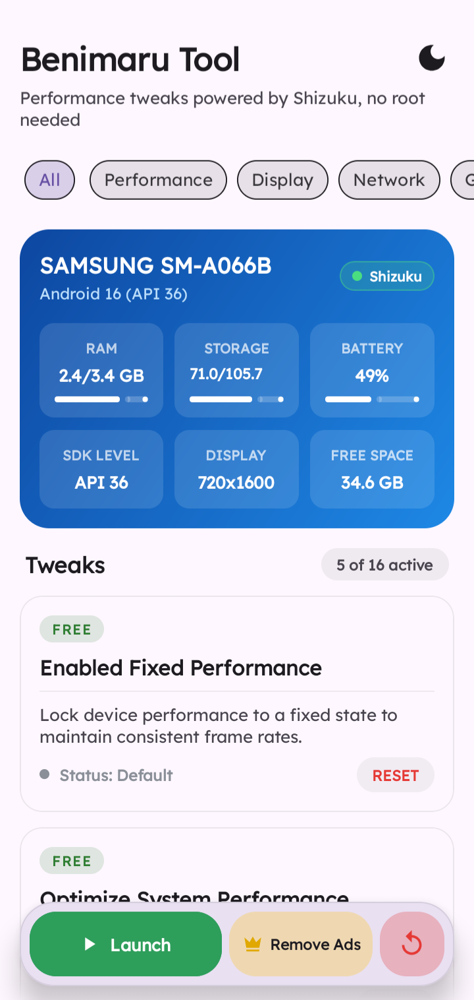
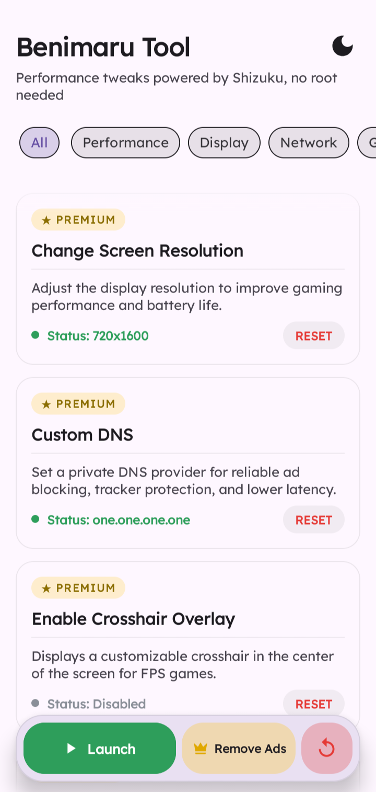
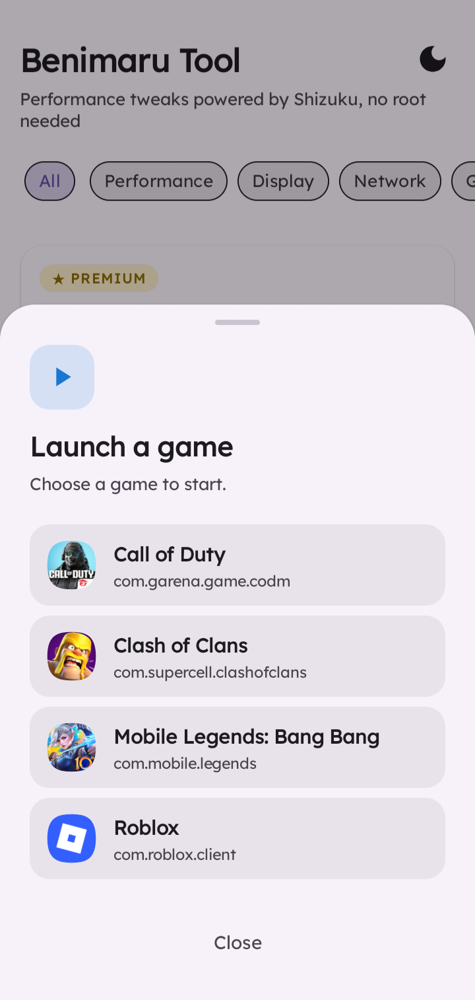

# 🚀️ Benimaru Tool ⚡️

**The Ultimate Rootless Android Optimization & Gaming Utility**

**Benimaru Tool** is a powerful, rootless Android utility application designed to push your device to its limits. By utilizing the [Shizuku](https://shizuku.rikka.app/) API, this app executes advanced ADB shell commands directly from your device—delivering kernel-level performance tweaks, touch latency reduction, and display customization **without requiring root access or a PC** after the initial setup.

---

## ✨ Features

Benimaru Tool is packed with everything you need to optimize your device, categorized for easy navigation.

### 🎮 Gaming & Performance

| Feature | Description |
|:--------|:------------|
| 🚀 **Fixed Performance Mode** | Locks device performance to a fixed state to maintain consistent frame rates during heavy workloads. |
| 🔥 **Disable Thermal Throttling** | Bypasses software temperature limits to prevent sudden frame drops and CPU throttling during long gaming sessions. |
| 🕹️ **Native Game Mode API** *(Android 12+)* | Unlocks deep performance by dropping system power limits and aggressively prioritizing CPU/GPU resources for your active game. |
| ⚡ **Touch Latency Reduction** | Increases the touch sampling rate and minimizes long-press timeouts for lightning-fast, precise screen interactions. |
| 🎮 **Game Launcher & Optimizer** | Automatically detects installed games to launch instantly or **pre-compile their DEX code (Speed Profile)** to eliminate in-game stutters. |
| 🎯 **FPS Crosshair Overlay** | Enable a customizable, center-screen crosshair to improve accuracy in mobile shooters. |

### 📺 Display & Visuals

| Feature | Description |
|:--------|:------------|
| 🔄 **Custom Refresh Rate** | Force specific Minimum and Maximum screen refresh rates (e.g., lock your display to a buttery smooth 120Hz). |
| 📱 **Safe Resolution Changer** | Adjust your display resolution to boost gaming FPS or extend battery life. Includes an **automatic aspect ratio calculator** and a **6-second safe-revert countdown** to prevent permanent black screens. |
| 💨 **UI Animation Speedup** | Cuts system animation scales in half (0.5x) making app launches and system navigation feel twice as fast. |
| 🌫️ **Disable Window Blurs** *(Android 12+)* | Frees up valuable GPU resources by turning off expensive real-time background blurs. |
| 🌗 **Dynamic Theme Engine** | Modern Light/Dark mode toggle featuring beautifully outlined Material Design cards that adapt to your system aesthetic. |

### 🛠️ System Tweaks & Utilities

| Feature | Description |
|:--------|:------------|
| 📊 **Floating Hardware Monitor** | An MSI Afterburner-style draggable HUD showing live CPU clock & thermals, RAM consumption, battery temps, and refresh rate. Position it anywhere without obstructing gameplay. |
| 💽 **Storage Optimizer (Fstrim)** | Forces the storage controller to wipe deleted data blocks, instantly restoring optimal read/write speeds. |
| 📶 **Network Tweaks** | Prioritizes network traffic and reduces ping for a lag-free mobile data experience. |
| 🌐 **Custom DNS Selector** | Set a system-wide private DNS (Cloudflare, Quad9, Control D, etc.) via ADB for ad blocking and tracker protection—no VPN required. |
| 🧹 **System Optimization** | Clears background processes and aggressively reallocates resources to your active applications. |
| 🔕 **Gaming Focus Mode** | Blocks intrusive heads-up notification banners from ruining your matches. |
| 🏦 **Hide Developer Options** | Instantly toggles off Developer Options so banking apps and anti-cheat games run without triggering security warnings. |

### ⚙️ App Experience

| Feature | Description |
|:--------|:------------|
| 🛡️ **Anti-Tamper Security** | Built-in SHA-256 signature verification prevents the execution of modified, repackaged, or unofficial APKs. |
| 📲 **In-App Auto Updater** | Automatically pings the official GitHub repository for new releases and handles seamless updates internally. |
| ⏪ **One-Tap Reset** | Panic button to instantly revert all tweaks back to your device's stock default settings. |

---

## 📸 Screenshots

<table align="center">
  <tr>
    <th align="center">Home Screen</th>
    <th align="center">Tweaks Menu</th>
    <th align="center">Hardware Monitor</th>
  </tr>
  <tr>
    <td align="center"></td>
    <td align="center"></td>
    <td align="center"></td>
  </tr>
</table>

---

## 📋 Prerequisites

> [!IMPORTANT]
> Because Benimaru Tool modifies secure system settings, it **requires Shizuku** to function.

| Step | Requirement | Details |
|:----:|:------------|:--------|
| 1 | **Install Shizuku** | If you do not have it, Benimaru Tool will prompt you to safely download it from the official GitHub repository. |
| 2 | **Activate Shizuku** | Start the Shizuku service via **Wireless Debugging (Android 11+)** or via ADB from a computer. [Read the official Shizuku setup guide here](https://shizuku.rikka.app/guide/setup/). |
| 3 | **Grant Overlay Permissions** | To use the Floating Hardware Monitor, Crosshair Overlay, and Floating Menu, grant the *"Display over other apps"* permission when prompted. |

---

## 🚀 Installation

| Step | Action |
|:----:|:-------|
| 1 | Navigate to the [Releases](../../releases) page. |
| 2 | Download the latest `BenimaruTool-vX.X.apk`. |
| 3 | Install the APK on your Android device. |
| 4 | Ensure the **Shizuku** app is installed and actively running in the background. |
| 5 | Open Benimaru Tool and tap **Allow** when prompted for Shizuku access. |
| 6 | Grant the **"Display over other apps"** permission to enable floating services. |
| 7 | Start tweaking! 🎉 |

---

## 🛠️ Built With

| Technology | Purpose |
|:-----------|:--------|
| **[Kotlin](https://kotlinlang.org/)** | 100% native Android development. |
| **[Material 3](https://m3.material.io/)** | Modern, responsive UI utilizing `MaterialCardView` for dynamic themes and programmatically generated dialogs. |
| **[Kotlin Coroutines](https://kotlinlang.org/docs/coroutines-overview.html)** | Ensuring smooth, non-blocking background task execution. |
| **[Shizuku API](https://github.com/RikkaApps/Shizuku-API)** | The magic behind executing elevated ADB commands without root. |
| **[Toasty](https://github.com/GrenderG/Toasty)** | Clean, stylized success and error popups. |

---

## ⚠️ Disclaimer

> [!WARNING]
> **Use at your own risk.**
> While Benimaru Tool is built with safety fail-safes (such as the 6-second resolution revert timer), forcing unsupported refresh rates, extreme resolutions, or disabling thermal limits on certain hardware configurations can cause system instability, overheating, or UI glitches. The developer is not responsible for bricked devices, bootloops, or hardware damage.

---

## 📝 License

This project is licensed under the MIT License - see the [LICENSE](LICENSE) file for details.

---

If you like Benimaru Tool, make sure to **star this repo** — it helps the project grow and keeps the updates coming!

